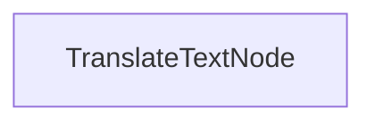

# Batch Translation Process

This project demonstrates a batch processing implementation that enables LLMs to translate documents 

## Features

- Translates markdown content into multiple languages in parallel
- Saves translated files to specified output directory

## Getting Started

1. Install the required packages:
```bash
pip install -r requirements.txt
```

## How It Works

The implementation uses a `TranslateTextNode` that processes batches of translation requests:



## Files

- [`main.py`](./main.py): Implementation of the batch translation node
- [`utils.py`](./utils.py): Simple wrapper for calling the Anthropic model
- [`requirements.txt`](./requirements.txt): Project dependencies
