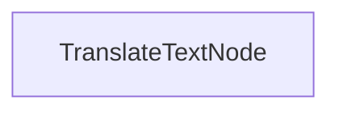

# 批量翻译过程

该项目演示了一种批处理实现，使 LLM 能够翻译文档

## 特性

- 将 markdown 内容并行翻译成多种语言
- 将翻译后的文件保存到指定的输出目录

## 开始使用

1. 安装所需的包：
```bash
pip install -r requirements.txt
```

## 工作原理

该实现使用 `TranslateTextNode` 处理批量翻译请求：



## 文件

- [`main.py`](./main.py): 批量翻译节点的实现
- [`utils.py`](./utils.py): 调用 Anthropic 模型的简单包装器
- [`requirements.txt`](./requirements.txt): 项目依赖项