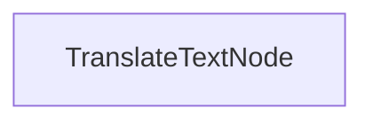

# Proceso de Traducción por Lotes

Este proyecto demuestra una implementación de procesamiento por lotes que permite a los LLMs traducir documentos 

## Características

- Traduce contenido markdown a múltiples idiomas en paralelo
- Guarda los archivos traducidos en el directorio de salida especificado

## Comenzando

1. Instala los paquetes requeridos:
```bash
pip install -r requirements.txt
```

## Cómo Funciona

La implementación utiliza un `TranslateTextNode` que procesa lotes de solicitudes de traducción:



## Archivos

- [`main.py`](./main.py): Implementación del nodo de traducción por lotes
- [`utils.py`](./utils.py): Wrapper simple para llamar al modelo Anthropic
- [`requirements.txt`](./requirements.txt): Dependencias del proyecto