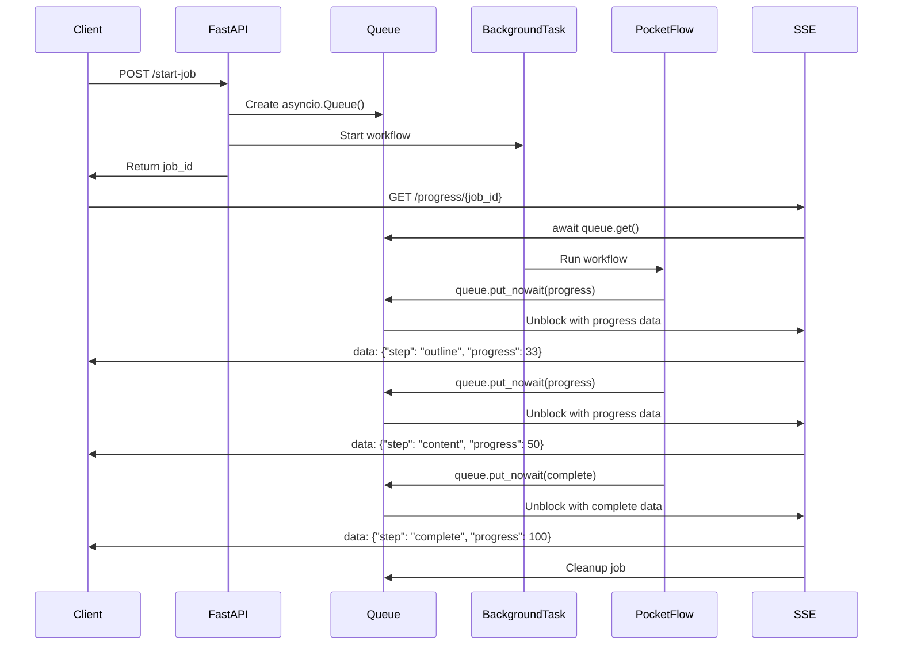

```mermaid
sequenceDiagram
    participant Client
    participant FastAPI
    participant Queue
    participant BackgroundTask
    participant PocketFlow
    participant SSE

    Client->>FastAPI: POST /start-job
    FastAPI->>Queue: Create asyncio.Queue()
    FastAPI->>BackgroundTask: Start workflow
    FastAPI->>Client: Return job_id

    Client->>SSE: GET /progress/{job_id}
    SSE->>Queue: await queue.get()

    BackgroundTask->>PocketFlow: Run workflow
    PocketFlow->>Queue: queue.put_nowait(progress)
    Queue->>SSE: Unblock with progress data
    SSE->>Client: data: {"step": "outline", "progress": 33}

    PocketFlow->>Queue: queue.put_nowait(progress)
    Queue->>SSE: Unblock with progress data
    SSE->>Client: data: {"step": "content", "progress": 50}

    PocketFlow->>Queue: queue.put_nowait(complete)
    Queue->>SSE: Unblock with complete data
    SSE->>Client: data: {"step": "complete", "progress": 100}
    SSE->>Queue: Cleanup job    
```
